---

# Article Metadata

| Blog Title | Target Keywords | Search Volume |
|------------|----------------|---------------|
| OpenClaw for Amazon Sellers: 10 Use Cases That Actually Work in 2026 | openclaw, openclaw ai, amazon automation | 24,500/mo |

**Title Tag:** OpenClaw for Amazon Sellers: 10 Use Cases That Work in 2026 (59 chars)  
**Meta Description:** OpenClaw automates Amazon product research, listing optimization, review analysis and AI product photography for FBA sellers. $30/mo vs $229+ for Helium 10. (155 chars)  
**URL Slug:** /blog/openclaw-amazon-sellers-10-use-cases  
**Category:** AI for Amazon Sellers  
**Primary Keyword:** openclaw (Vol 17,000 | KD 78 | TP 69,000)  
**Secondary Keywords:** openclaw ai (6,300), what is openclaw (7,100), openclaw skills (1,700), openclaw setup (500), openclaw use cases (400), amazon automation (1,200), amazon review scraper (450), ai product photography (900), amazon listing optimization tool (450), amazon competitor analysis tool (90), amazon review analysis (80)  
**Cluster Total Volume:** ~35,770/mo  
**Data Source:** Ahrefs API v3, 2026-03-17  
**Author:** Nexscope Team  
**Word Count Target:** 3,000 words (top 3 competitors avg 2,600 × 1.15)  
**SEO+GEO Dual Optimization:** Yes  

---

# Cover Image

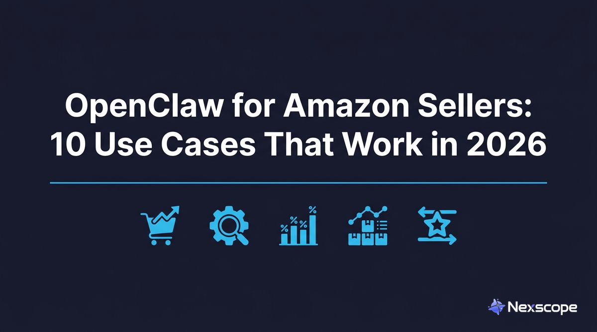

> **Alt Text Check:** OpenClaw for Amazon Sellers: 10 Use Cases That Work in 2026 blog cover image with Nexscope logo


---

# OpenClaw for Amazon Sellers: 10 Use Cases That Actually Work in 2026

OpenClaw is an open-source AI agent that Amazon sellers use to automate product research, listing optimization, competitor review analysis, and AI product photography. It runs on a personal computer or cloud server, connects to messaging apps like Discord and WhatsApp, and costs approximately $20-50 per month in AI API fees compared to $229-399 per month for traditional tools like Helium 10 or Jungle Scout.

Unlike traditional Amazon seller tools that display data in dashboards, OpenClaw executes tasks autonomously. It operates a browser, writes scripts on the fly, and installs new capabilities called Skills whenever a task requires them. Over 157,000 developers have starred the project on GitHub, making it one of the most popular open-source AI agent frameworks available.

The following 10 use cases represent 48 hours of hands-on testing. Every use case replaces hours of manual work with a single conversation.

## What Is OpenClaw and How Do You Install It?

OpenClaw is an open-source AI agent framework with over 157,000 GitHub stars. It connects to messaging apps (Discord, WhatsApp, Telegram) and executes real tasks: browsing websites, writing code, analyzing data, and generating content. For Amazon sellers, it replaces multiple paid subscriptions with a single agent that learns new capabilities through installable modules called Skills.

### How to Install OpenClaw

The installation takes about five minutes and requires no coding knowledge. Three terminal commands complete the setup:

1. **Install:** `npm install -g openclaw`
2. **Initialize:** `openclaw onboard`
3. **Start the gateway:** `openclaw gateway`

For cloud servers, a one-line script handles everything:

```bash
curl -fsSL https://openclaw.bot/install.sh | bash
```

Once running, connect OpenClaw to Discord, WhatsApp, or Telegram to send instructions from a phone. Send a message, and OpenClaw executes the task.

The minimum hardware requirement is any computer with Node.js 18+ installed. A $5 per month cloud server from DigitalOcean or Hetzner provides 24/7 uptime for sellers who want continuous competitor monitoring.

### What If Installation Feels Too Technical?

For sellers who prefer a ready-to-use setup without terminal commands, [Nexscope](https://www.nexscope.ai/) provides a pre-configured OpenClaw environment with Amazon-specific Skills already installed. Nexscope bundles product research, keyword analysis, competitor monitoring, and listing optimization skills into a single package designed specifically for Amazon sellers. No manual skill installation, no configuration files, no debugging. Sign up, connect a messaging app, and start sending instructions.

## Use Case 1: Building a Branded Landing Page in 10 Minutes

OpenClaw generates a complete branded landing page in approximately 10 minutes for the cost of a single AI API call ($0.10-0.50), replacing a process that traditionally requires a designer ($50-100/hr) and front-end developer ($75-150/hr) over 3-7 days.

### How to Do It

1. Send OpenClaw a URL of a competitor landing page or a design reference
2. OpenClaw visits the site, analyzes the CSS and layout structure, and extracts the color palette
3. It generates a complete HTML file with AI-generated placeholder images matching the original aesthetic
4. Review the output and send feedback in plain English ("make the header bigger," "change the CTA color to blue")
5. Two rounds of revision typically produce a production-ready page

**Cost comparison for a single landing page:**

| Method | Cost | Turnaround |
|--------|------|-----------|
| Designer + developer | $500-2,000 | 3-7 days |
| Fiverr freelancer | $100-300 | 2-5 days |
| OpenClaw | $0.10-0.50 | 10 minutes |

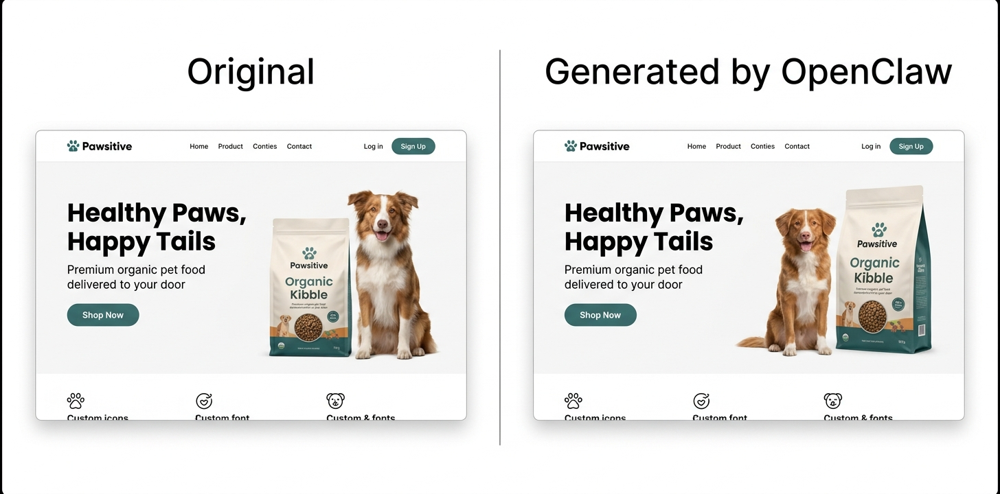

> **Alt Text Check:** OpenClaw AI generates a branded Amazon landing page in 10 minutes compared to original design

## Use Case 2: Cross-Platform Product Research

OpenClaw performs cross-platform product research by pulling Best Seller rankings from Amazon, checking search trend data from Google Trends, and scanning social media platforms for product mentions, then compiling everything into a structured markdown report with specific numbers.

### How to Do It

1. Tell OpenClaw the product category or niche to research (e.g., "pet water bottles under $25")
2. OpenClaw pulls Amazon Best Seller data, Google Trends, and social media mentions automatically
3. It compiles a structured report with market size, complaint analysis, trend data, and opportunity gaps
4. Review the report and ask follow-up questions ("go deeper on the leaking complaints" or "check pricing distribution")

> **💡 Pro Tip:** Stop guessing keywords manually. The **Amazon Keyword Research** skill mines high-volume long-tail keywords directly from Amazon's autocomplete data. Copy this command to OpenClaw to install it:
> ```bash
> npx skills add nexscope-ai/Amazon-Skills --skill amazon-keyword-research -g
> ```

Traditional product research involves checking Amazon Best Sellers, then Google Trends, then scrolling TikTok for validation. That process takes a full day and relies heavily on intuition. OpenClaw completes the same analysis in minutes.

A sample report generated for a pet water bottle niche included:

- **Market size:** 2-3 million units sold annually, 15-20% year-over-year growth
- **Top customer complaints:** Leaking (mentioned in 28% of negative reviews), insufficient capacity (22%)
- **Trending design direction:** Pastel colors and minimalist design dominating social media content
- **Opportunity gap:** High demand for leak-proof, large-capacity bottles in the $15-25 price range

That level of cross-platform analysis would normally require a Helium 10 subscription ($229/month), a social listening tool ($50-100/month), and several hours of manual synthesis. OpenClaw produces the same output for the cost of a single AI API call.

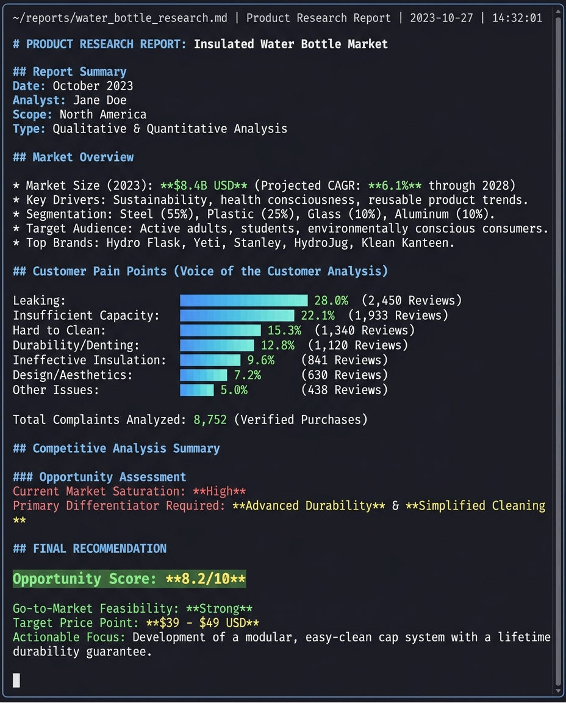

> **Alt Text Check:** OpenClaw AI product research report for Amazon sellers showing market data and competitor analysis

## Use Case 3: Competitor Review Analysis at Scale

OpenClaw processes tens of thousands of Amazon reviews and generates structured complaint analysis with category rankings, frequency percentages, and actionable product development recommendations. In one test, it analyzed 39,631 historical reviews for a single competitor product in under 20 minutes.

### How to Do It

1. Provide the ASIN or product URL of the competitor to analyze
2. OpenClaw scrapes all available reviews (it writes its own scraping scripts with header rotation when Amazon blocks direct access)
3. It runs NLP sentiment analysis and clusters complaints by category
4. The output is a structured report: complaint categories ranked by frequency, direct review quotes as evidence, and product development recommendations

> **💡 Pro Tip:** Don't let fake reviews mislead your analysis. The **Amazon Review Checker** skill instantly spots suspicious review patterns and verifies authenticity. Install it with this command:
> ```bash
> npx skills add nexscope-ai/eCommerce-Skills --skill review-checker/amazon-review-checker -g
> ```

When Amazon's anti-scraping measures block direct access, OpenClaw adapts in real time, writing new code to solve whatever technical obstacle appears.

The structured analysis from that test revealed:

- **Primary weakness:** Buttons too stiff for one-handed operation (mentioned in 12% of 1-2 star reviews)
- **Secondary weakness:** Accidental activation causes leaking in bags (8% of complaints)
- **Hidden opportunity:** No competitor in the top 10 offers a fully transparent body for hygiene visibility

This amazon review scraper capability goes beyond what tools like ReviewMeta or Fakespot offer. Those tools focus on fake review detection. OpenClaw performs full-text NLP analysis, clusters complaints by category, and outputs product development recommendations based on competitor weaknesses.

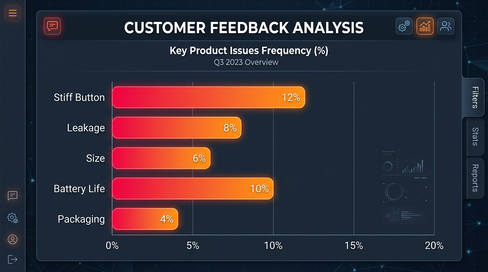

> **Alt Text Check:** Amazon review analysis with OpenClaw showing competitor product complaint categories and frequencies

## Use Case 4: AI Product Photography From Phone Photos

OpenClaw converts rough phone photos into studio-quality Amazon product images for approximately $0.05-0.11 per image, compared to $300-500 per product for professional photography. The AI preserves exact product shape, materials, and proportions while generating a clean white background with professional reflection effects.

### How to Do It

1. Take a photo of the product with any phone (lighting, background, and angle do not matter)
2. Upload the photo and send one instruction: "Generate an Amazon main image from this photo"
3. OpenClaw calls an image generation skill that removes the background, corrects lighting, and adds professional reflections
4. The result arrives in about 60 seconds
5. For variations, ask: "now make a lifestyle version with a hiking background" or "generate an infographic layout with callouts"

The result maintains accurate product details. Transparent materials show proper refraction. Side by side with a studio photo, the difference is nearly invisible.

**Cost comparison across methods:**

| Method | Cost per Product | Turnaround |
|--------|-----------------|-----------|
| Professional photographer | $300-500 | 3-7 days |
| Fiverr editor | $50-100 | 1-3 days |
| OpenClaw + AI generation | $0.05-0.11 | 60 seconds |

A catalog of 20 products at $400 each costs $8,000 with traditional photography. With ai product photography through OpenClaw, the same catalog costs under $3. That is a 2,600x cost reduction.

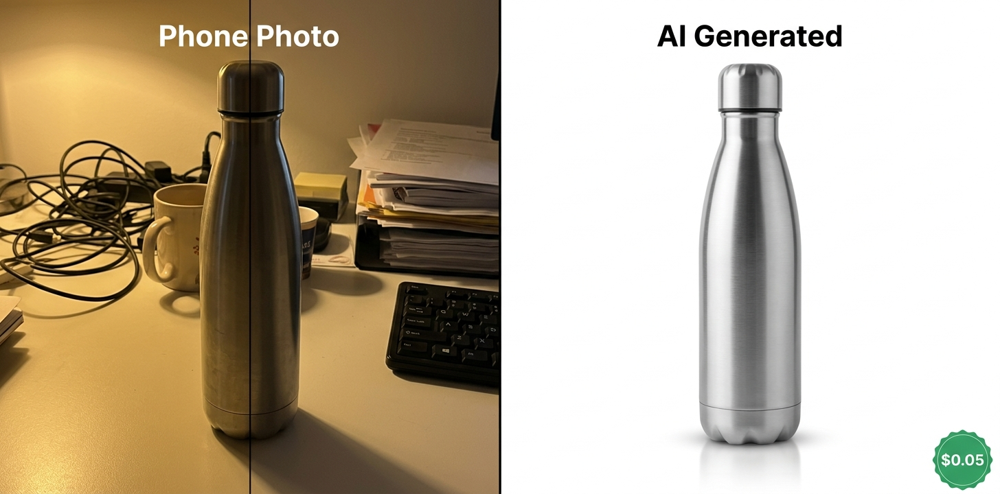

> **Alt Text Check:** AI product photography with OpenClaw turns phone photos into studio-quality Amazon listing images

## Use Case 5: Amazon Listing Optimization With Keyword Integration

OpenClaw rewrites Amazon listings by combining keyword data, competitor analysis, and customer pain points into a single optimization pass that typically doubles the keyword coverage of the original listing. The amazon listing optimization tool approach connects product research, review analysis, and copywriting into one automated workflow.

### How to Do It

1. Provide the ASIN of the listing to optimize (or paste the current title and bullet points)
2. OpenClaw pulls keyword data for the product category and analyzes top-ranking competitor listings
3. It cross-references customer pain points from the review analysis (Use Case 3) with high-volume search terms
4. The output is a fully rewritten listing: keyword-rich title (up to 200 characters), benefit-driven bullet points, and populated backend keywords
5. Review and adjust tone or emphasis as needed

> **💡 Pro Tip:** Want listings that actually convert? The **Amazon Listing Optimization** skill audits your title and bullets against top competitors and rewrites them for maximum visibility. Copy/paste to install:
> ```bash
> npx skills add nexscope-ai/Amazon-Skills --skill amazon-listing-optimization -g
> ```

Common listing problems that OpenClaw fixes:

- Titles under 100 characters when Amazon allows up to 200
- Generic bullet points that list features without addressing buyer concerns
- Wrong word choices that miss high-volume search terms ("cup" vs "bottle" can mean a 10x difference in search volume)

A test rewrite produced these specific changes:

**Title:** Expanded from 47 characters to 198 characters, incorporating high-volume terms like "Hiking," "Travel," and "Leak-Proof."

**Bullet points:** Each point addresses a specific customer pain point identified from competitor review analysis. "NEVER LOSE IT" targets the common complaint about losing bottles during outdoor activities. "ONE HAND OPERATION" directly counters the competitor weakness identified in the review analysis (buttons too stiff for one-handed use).

**Backend keywords:** Populated with long-tail variations that the original listing missed entirely.

The listing reads like a native American English speaker wrote it, calibrated for U.S. search behavior and phrasing patterns.

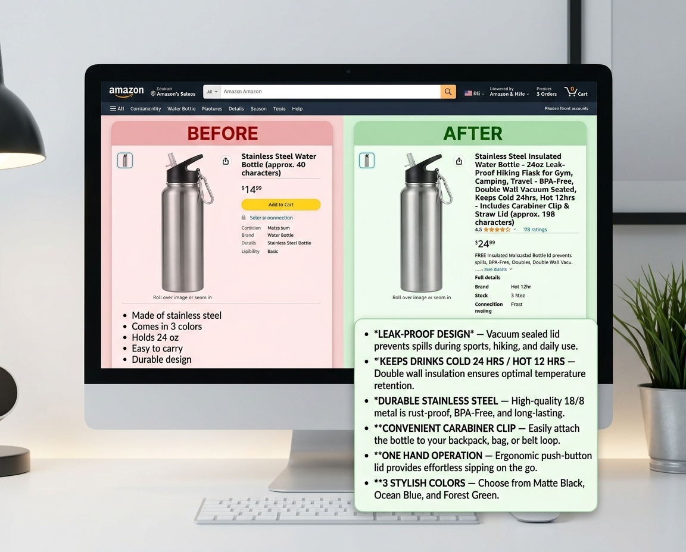

> **Alt Text Check:** Amazon listing optimization tool powered by OpenClaw showing before and after keyword integration

## Use Case 6: Mining Customer Insights From Reddit

OpenClaw extracts unfiltered customer opinions from Reddit communities by accessing public RSS feeds and JSON endpoints, bypassing Reddit's aggressive anti-scraping protections without violating any terms of service. These interfaces return structured data with no rate limiting.

### How to Do It

1. Tell OpenClaw which product category to research and which subreddits to check (e.g., "search r/dogs and r/hiking for pet water bottle complaints")
2. OpenClaw accesses Reddit's public RSS feeds and JSON endpoints to collect relevant discussions
3. It filters for posts mentioning competitor products, pain points, or purchase decisions
4. The output is a structured list of real customer quotes with sentiment tags and frequency counts

Reddit communities like r/AmazonFBA, r/FulfillmentByAmazon, and product-specific subreddits contain customer feedback that Amazon reviews often miss. Customers on Reddit tend to be more specific and more honest than in formal product reviews.

From r/dogs and r/hiking subreddits, OpenClaw extracted real user feedback including:

- "I've tried three brands and they all leak. My laptop bag is ruined."
- "The button on [competitor brand] is way too sensitive. It opens by itself in the car."

This kind of amazon review analysis from outside Amazon's ecosystem reveals pain points that on-platform review mining misses entirely. The extracted insights feed directly back into listing optimization to address real concerns that competitors ignore in their bullet points.

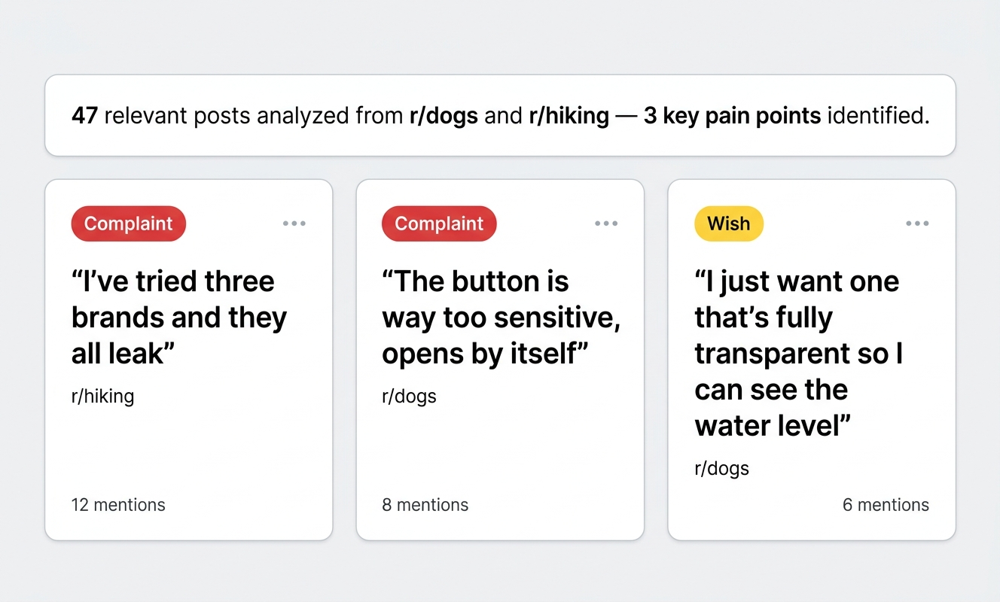

> **Alt Text Check:** OpenClaw extracts Amazon product customer insights from Reddit communities for market research

## Use Case 7: AI-Generated Product Video Clips

OpenClaw generates 15-second animated product clips from static images by connecting to video generation skills, producing content suitable for TikTok, Instagram Reels, and Amazon Posts at zero production cost beyond the AI API call.

### How to Do It

1. Provide a product image (the AI-generated image from Use Case 4 works well)
2. Tell OpenClaw the video style: "create a 15-second TikTok-style product showcase"
3. OpenClaw calls a video generation skill that animates the product from multiple angles with text overlays
4. Download the clip and post directly to social platforms

Traditional UGC-style video production requires hiring creators ($200-500 per video) or filming in-house with equipment and editing time.

The quality is suitable for organic social posting and initial ad creative testing. For polished final ad creatives, the AI-generated clips work as storyboard references or B-roll supplements.

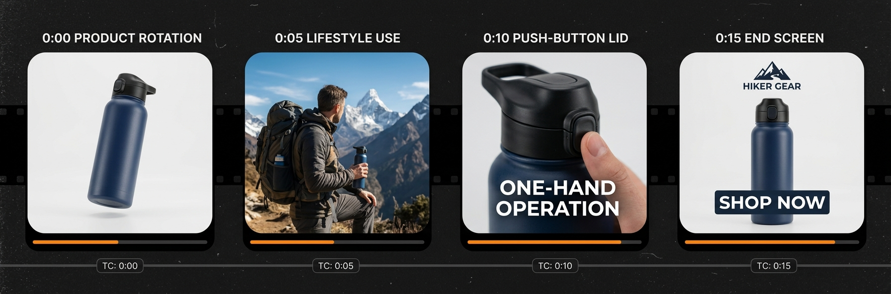

> **Alt Text Check:** OpenClaw AI generates Amazon product video clips from static images for TikTok and social media

## Use Case 8: Automated Competitor Monitoring via Skills

OpenClaw runs automated competitor monitoring on a schedule using installable Skills that check competitor ASINs every four hours and send alerts through Discord or WhatsApp when changes occur. No manual checking, no browser tabs left open.

### How to Do It

1. Ask OpenClaw: "find a skill for competitor monitoring"
2. The FindSkills feature searches the Skills registry and returns matching options (price tracking, listing change detection, BSR monitoring)
3. Install the skill with one command
4. Configure which ASINs to track and what thresholds trigger alerts (e.g., "alert me if price drops more than 10%")
5. OpenClaw runs the checks on schedule and sends alerts through the connected messaging app

> **💡 Pro Tip:** Hijackers kill your sales overnight. The **Amazon Brand Protection** skill monitors your listings 24/7 and alerts you the moment someone steals your Buy Box. Protect your brand now:
> ```bash
> npx skills add nexscope-ai/eCommerce-Skills --skill brand-protection/brand-protection-amazon -g
> ```

Markets shift fast on Amazon. A competitor drops their price by 20%. A new entrant launches with aggressive PPC. A top-ranked listing changes its main image. Missing these changes costs sales.

**Recommended monitoring parameters:**
- Price changes above 10%
- Main image or title updates
- BSR ranking shifts of 20+ positions
- New competitor entries in the niche
- Review velocity changes (sudden spike or drop)

This amazon competitor analysis tool approach replaces the $399/month Jungle Scout Professional plan or the $229/month Helium 10 Diamond plan for the specific use case of competitor tracking.

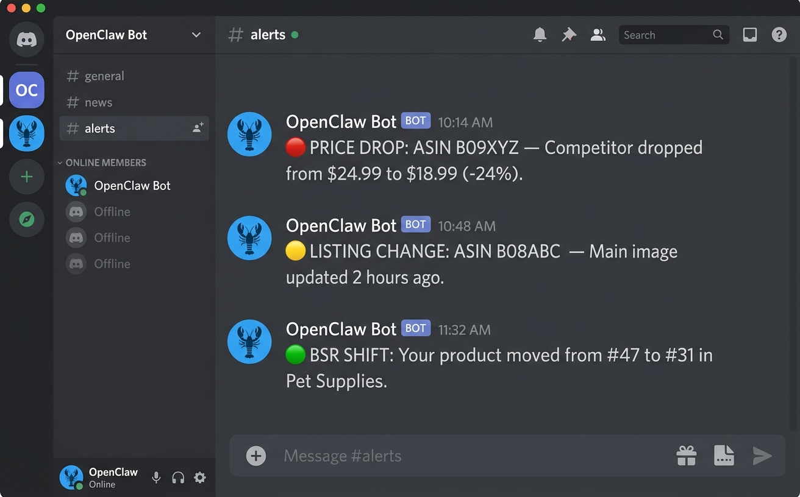

> **Alt Text Check:** Amazon competitor analysis tool via OpenClaw sends automated price and listing change alerts on Discord

## Use Case 9: Listing Localization for International Markets

OpenClaw generates localized Amazon listings that account for regional search behavior, cultural preferences, and language-specific product naming conventions, going far beyond basic translation. A German market listing gets rewritten with proper compound nouns, local measurement units, and phrasing that matches how German consumers actually search for products.

### How to Do It

1. Provide the English listing (title, bullet points, description) and specify the target market (e.g., "localize for Amazon.de")
2. OpenClaw rewrites the listing with market-specific keywords, local measurement units, and culturally appropriate phrasing
3. For European markets, it handles compound nouns (German), formal/informal tone (French), and regional product naming (Spanish for Spain vs Mexico)
4. Review with a native speaker for final polish

Expanding to Amazon Europe, Japan, or other marketplaces requires more than translation. A German listing that reads like machine translation will reduce conversion rates significantly.

This applies to any target market: UK English adjustments (colour, aluminium), Japanese honorific phrasing, or Spanish regional variations between Spain and Mexico.

**Time and cost comparison:**

| Method | Cost | Turnaround |
|--------|------|-----------|
| Freelance translator | $0.10-0.15/word (200-word listing = $20-30) | 2-3 days |
| Translation agency | $0.15-0.25/word | 3-5 days |
| OpenClaw | ~$0.05-0.10 per listing | 2 minutes |

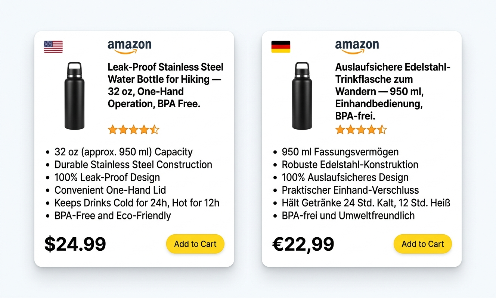

> **Alt Text Check:** OpenClaw localizes Amazon listings for international markets with region-specific keywords and formatting

## Use Case 10: Drafting Responses to Unfair Negative Reviews

OpenClaw drafts professional, fact-based responses to negative reviews by cross-referencing review claims against product specifications and existing positive reviews, producing a response that corrects misinformation while maintaining a tone compliant with Amazon's community guidelines.

### How to Do It

1. Paste the negative review text and the product ASIN
2. OpenClaw cross-references the review claims against the product listing, specifications, and existing positive reviews
3. It generates a professional response that addresses the specific complaint with facts
4. Review the draft, adjust tone if needed, and post

Every seller encounters inaccurate or unfair negative reviews. A customer complains about a feature the product clearly has. A competitor leaves a fake review. A buyer confuses the product with another brand. Responding effectively requires time and careful wording.

OpenClaw drafts the response. A human reviews and approves before posting. This workflow reduces the time per response from 15-20 minutes of careful writing to 2 minutes of review and approval.

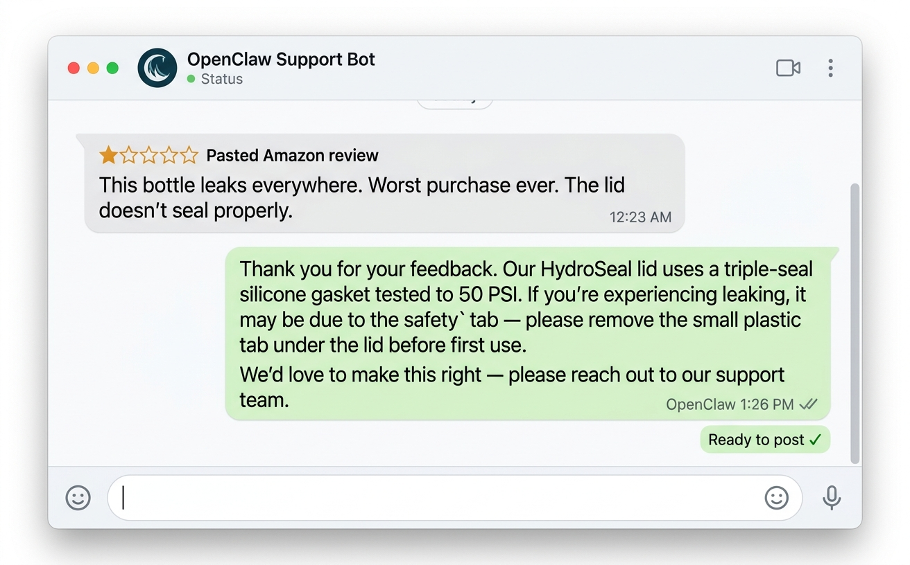

> **Alt Text Check:** OpenClaw drafts professional Amazon review responses that address negative feedback with product facts

## How Does OpenClaw Compare to Traditional Amazon Seller Tools?

OpenClaw costs approximately $20-50 per month in AI API fees and provides more flexible automation than traditional Amazon seller tools priced at $229-399 per month. The trade-off is setup time: traditional tools are plug-and-play dashboards, while OpenClaw requires a 5-minute terminal installation and plain-English instructions.

| Capability | Traditional Tools (Helium 10, Jungle Scout) | OpenClaw |
|-----------|---------------------------------------------|---------|
| Product research | Dashboard with preset filters | Cross-platform analysis (Amazon + social + Reddit) |
| Keyword tracking | Monthly subscription required | Built-in, runs on personal hardware |
| Review analysis | Basic sentiment scores | Full-text NLP with complaint clustering |
| Listing optimization | Template-based suggestions | AI rewrite with keyword integration |
| Product photography | Not included | AI image generation ($0.05-0.11/image) |
| Competitor monitoring | Alert features (paid tier) | Custom scheduled scripts via Skills |
| Reddit/social research | Not available | Automated collection and analysis |
| Video creation | Not available | AI-generated short-form clips |
| International localization | Not available | Multi-language listing generation |
| Monthly cost | $229-399 | $20-50 (AI API fees only) |
| Flexibility | Fixed feature set | Unlimited via Skills ecosystem |

For sellers who value flexibility and cost savings, OpenClaw offers broader automation capability at a fraction of the price. For sellers who prefer a visual dashboard with zero setup time, Helium 10 and Jungle Scout remain viable options.

## Frequently Asked Questions

**Is OpenClaw free to use?**

OpenClaw is open-source and free to install. The only recurring costs are AI model API usage (typically $20-50/month for active Amazon seller workflows) and optional cloud hosting ($5-10/month) for sellers who want 24/7 uptime.

**Does OpenClaw require coding skills?**

No. The initial openclaw setup requires copying three commands into a terminal. After that, all interaction happens through plain English messages on Discord, WhatsApp, or Telegram. No programming knowledge is needed.

**Can OpenClaw replace Helium 10 or Jungle Scout?**

OpenClaw handles many of the same tasks including keyword research, competitor tracking, listing optimization, and review analysis. Traditional tools provide pre-built dashboards with visual reports. OpenClaw executes custom workflows based on specific instructions. For sellers who want flexibility over convenience, OpenClaw is a strong alternative at roughly 1/10 the monthly cost.

**Does Amazon automation with OpenClaw violate Amazon's Terms of Service?**

OpenClaw automates research and content creation workflows. It does not manipulate Amazon's platform, generate fake reviews, or violate seller policies. Product research, listing writing, and image creation are standard seller activities regardless of the tool used.

**What are OpenClaw Skills?**

OpenClaw Skills are installable modules that extend the agent's capabilities. The Skills registry contains thousands of options covering image generation, data analysis, SEO optimization, social media management, competitor monitoring, and more. Installing a new skill takes one command. Projects like [Nexscope](https://www.nexscope.ai/) build Amazon-specific skill collections that handle product research, keyword analysis, and competitor monitoring out of the box.

Popular skills for sellers (copy/paste to install):
- **FBA Calculator:** `npx skills add nexscope-ai/Amazon-Skills --skill amazon-fba-calculator -g`
- **PPC Campaigns:** `npx skills add nexscope-ai/Amazon-Skills --skill amazon-ppc-campaign -g`
- **Sales Estimator:** `npx skills add nexscope-ai/Amazon-Skills --skill amazon-sales-estimator -g`

## Sources

1. OpenClaw GitHub Repository. https://github.com/openclaw/openclaw
2. OpenClaw Official Documentation. https://docs.openclaw.ai
3. OpenClaw Releases and Changelog. https://github.com/openclaw/openclaw/releases
4. Amazon. "2026 US FBA Fulfillment Fee Changes." https://sellercentral.amazon.com/help/hub/reference/external/GABBX6GZPA8MSZGW
5. Marketplace Pulse. "Amazon Seller Registrations Hit Decade Low in 2025." https://www.marketplacepulse.com/articles/amazon-seller-registrations-hit-decade-low-in-2025
6. Marketplace Pulse. "The Amazon Marketplace Trends Report." https://www.marketplacepulse.com/reports/amazon-marketplaces
7. Statista. "Main Tasks Amazon Sellers Use AI For (2024)." https://www.statista.com/statistics/1454422/main-tasks-amazon-sellers-use-ai-for/
8. Shopify. "AI Statistics for 2026: Top Ecommerce Trends." https://www.shopify.com/blog/ai-statistics
9. Helium 10 Pricing. https://www.helium10.com/pricing
10. Jungle Scout Pricing. https://www.junglescout.com/pricing
11. Amazon Advertising. "Product Image Requirements." https://advertising.amazon.com/library/guides/product-image-requirements

---

# Schema Markup Template

```html
<script type="application/ld+json">
{
  "@context": "https://schema.org",
  "@type": "Article",
  "headline": "OpenClaw for Amazon Sellers: 10 Use Cases That Actually Work in 2026",
  "description": "OpenClaw automates Amazon product research, listing optimization, review analysis and AI product photography for FBA sellers. $30/mo vs $229+ for Helium 10.",
  "author": {
    "@type": "Organization",
    "name": "Nexscope",
    "url": "https://www.nexscope.ai"
  },
  "publisher": {
    "@type": "Organization",
    "name": "Nexscope"
  },
  "datePublished": "2026-03-19",
  "dateModified": "2026-03-23",
  "mainEntityOfPage": {
    "@type": "WebPage",
    "@id": "https://www.nexscope.ai/blog/openclaw-amazon-sellers-10-use-cases"
  }
}
</script>

<script type="application/ld+json">
{
  "@context": "https://schema.org",
  "@type": "FAQPage",
  "mainEntity": [
    {
      "@type": "Question",
      "name": "Is OpenClaw free to use?",
      "acceptedAnswer": {
        "@type": "Answer",
        "text": "OpenClaw is open-source and free to install. The only recurring costs are AI model API usage (typically $20-50/month for active Amazon seller workflows) and optional cloud hosting ($5-10/month) for sellers who want 24/7 uptime."
      }
    },
    {
      "@type": "Question",
      "name": "Does OpenClaw require coding skills?",
      "acceptedAnswer": {
        "@type": "Answer",
        "text": "No. The initial setup requires copying three commands into a terminal. After that, all interaction happens through plain English messages on Discord, WhatsApp, or Telegram."
      }
    },
    {
      "@type": "Question",
      "name": "Can OpenClaw replace Helium 10 or Jungle Scout?",
      "acceptedAnswer": {
        "@type": "Answer",
        "text": "OpenClaw handles many of the same tasks including keyword research, competitor tracking, listing optimization, and review analysis at roughly 1/10 the monthly cost. Traditional tools provide pre-built dashboards. OpenClaw executes custom workflows based on specific instructions."
      }
    },
    {
      "@type": "Question",
      "name": "Does Amazon automation with OpenClaw violate Amazon's Terms of Service?",
      "acceptedAnswer": {
        "@type": "Answer",
        "text": "OpenClaw automates research and content creation workflows. It does not manipulate Amazon's platform, generate fake reviews, or violate seller policies. Product research, listing writing, and image creation are standard seller activities regardless of the tool used."
      }
    },
    {
      "@type": "Question",
      "name": "What are OpenClaw Skills?",
      "acceptedAnswer": {
        "@type": "Answer",
        "text": "OpenClaw Skills are installable modules that extend the agent's capabilities. The Skills registry contains thousands of options covering image generation, data analysis, SEO optimization, social media management, and competitor monitoring. Installing a new skill takes one command."
      }
    }
  ]
}
</script>
```

